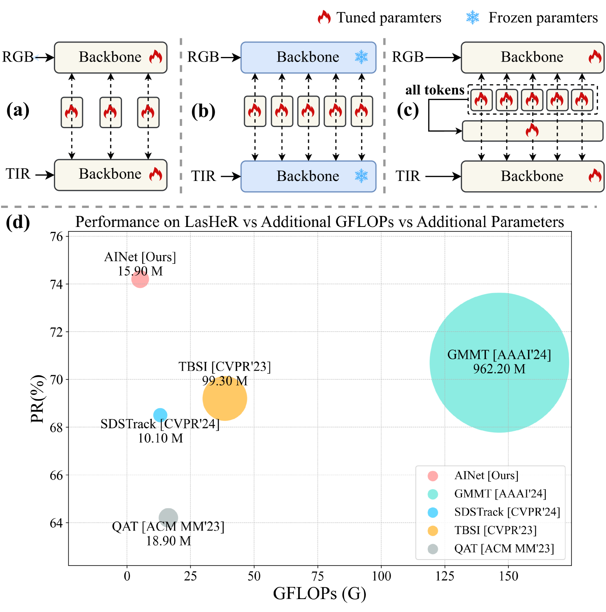
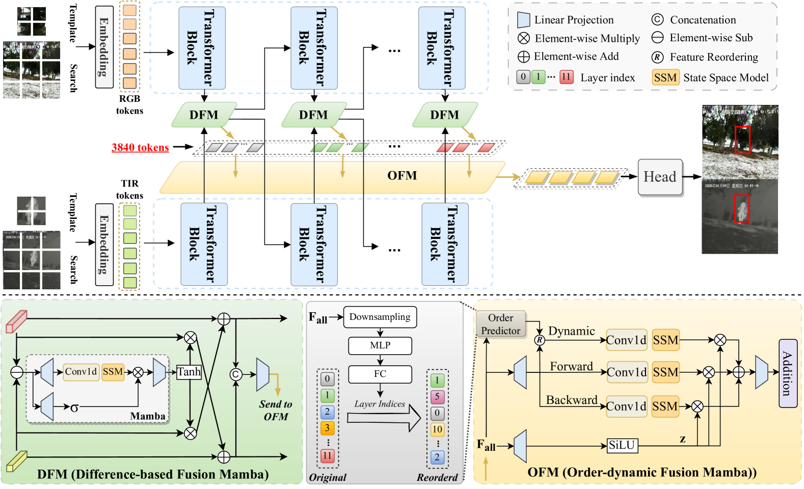
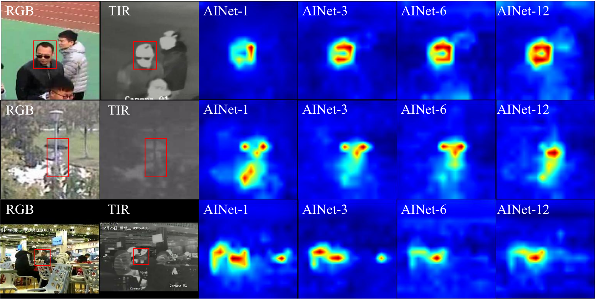
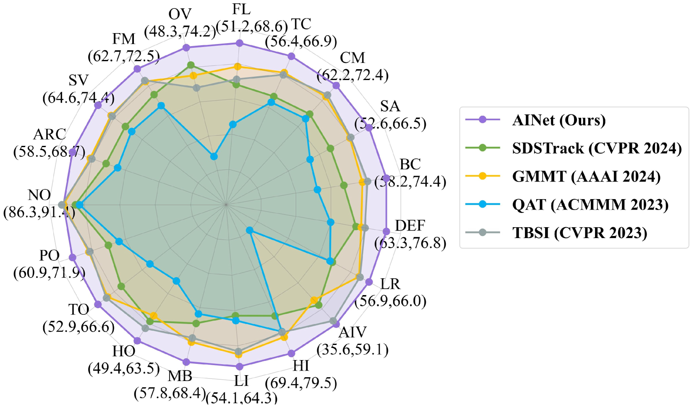
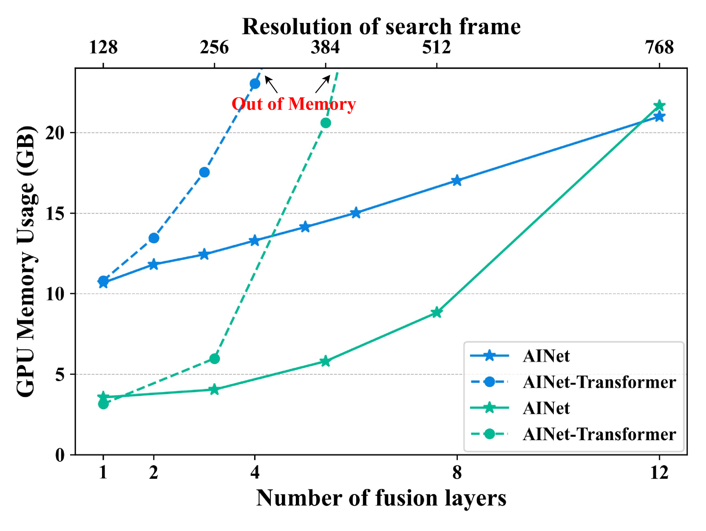

# 采用渐进融合曼巴策略，通过全层多模态交互实现RGBT跟踪

发布时间：2024年08月16日

`Agent` `计算机视觉` `机器人技术`

> RGBT Tracking via All-layer Multimodal Interactions with Progressive Fusion Mamba

# 摘要

> 为了克服现有RGBT跟踪方法在跨模态融合中的计算负担，我们推出了全新的全层多模态交互网络AINet。该网络通过渐进式融合Mamba，实现了模态间与层间的高效特征交互，显著提升了RGBT跟踪的鲁棒性。尽管各层模态特征各异，我们仍通过差异融合Mamba（DFM）巧妙融合RGB与热模态的互补信息，且复杂度仅为线性。面对大规模令牌序列的挑战，顺序动态融合Mamba（OFM）动态调整层间交互顺序，确保了计算效率。实验结果显示，AINet在多个公开数据集上超越了现有顶尖方法，展现了其卓越性能。

> Existing RGBT tracking methods often design various interaction models to perform cross-modal fusion of each layer, but can not execute the feature interactions among all layers, which plays a critical role in robust multimodal representation, due to large computational burden. To address this issue, this paper presents a novel All-layer multimodal Interaction Network, named AINet, which performs efficient and effective feature interactions of all modalities and layers in a progressive fusion Mamba, for robust RGBT tracking. Even though modality features in different layers are known to contain different cues, it is always challenging to build multimodal interactions in each layer due to struggling in balancing interaction capabilities and efficiency. Meanwhile, considering that the feature discrepancy between RGB and thermal modalities reflects their complementary information to some extent, we design a Difference-based Fusion Mamba (DFM) to achieve enhanced fusion of different modalities with linear complexity. When interacting with features from all layers, a huge number of token sequences (3840 tokens in this work) are involved and the computational burden is thus large. To handle this problem, we design an Order-dynamic Fusion Mamba (OFM) to execute efficient and effective feature interactions of all layers by dynamically adjusting the scan order of different layers in Mamba. Extensive experiments on four public RGBT tracking datasets show that AINet achieves leading performance against existing state-of-the-art methods.

[Arxiv](https://arxiv.org/abs/2408.08827)