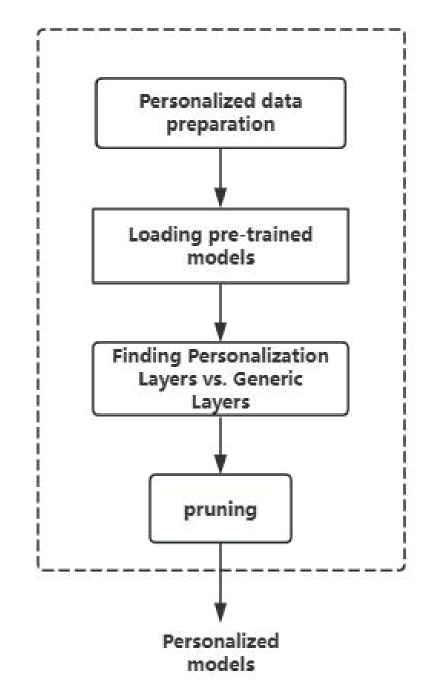
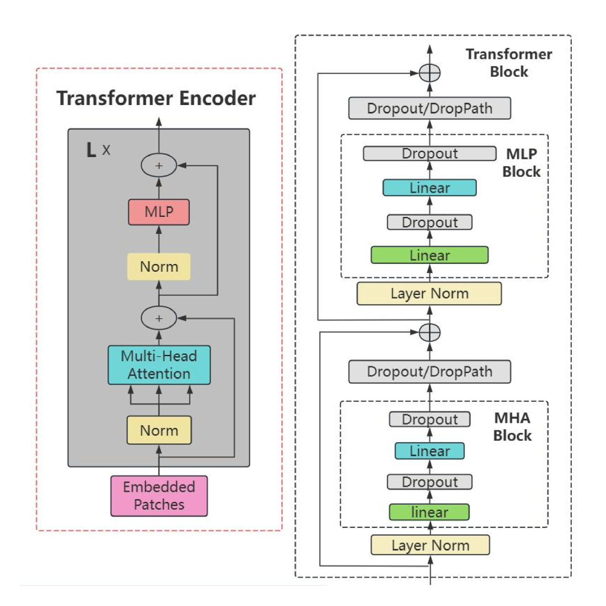
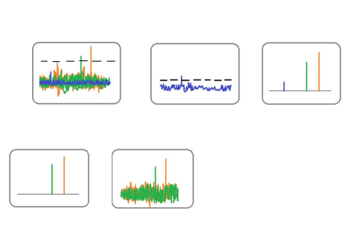

# 本研究探索了一种基于同态熵增原理的预训练模型个性化压缩算法，旨在提升模型压缩的定制化效果。

发布时间：2024年08月16日

`LLM应用` `移动设备` `人工智能`

> Research on Personalized Compression Algorithm for Pre-trained Models Based on Homomorphic Entropy Increase

# 摘要

> 本文深入探讨了AI领域的两大技术——Vision Transformer与大型语言模型（LLM）的演进与挑战。Vision Transformer虽能通过图像分割与多头注意力机制捕捉全局信息，但其高计算成本限制了移动端的应用。与此同时，LLM在自然语言处理领域的突破性进展，也伴随着部署难题。为此，我们聚焦模型剪枝技术，旨在精简参数而不损精度，以适应个性化需求与资源限制。我们创新性地提出分层剪枝策略，通过压缩感知与随机采样，有效区分并简化模型层级，大幅降低参数数量。实验证明，步骤缓冲机制的引入进一步提升了剪枝后模型的准确性，为未来移动端高效个性化AI模型的部署开辟了新路径。

> In this article, we explore the challenges and evolution of two key technologies in the current field of AI: Vision Transformer model and Large Language Model (LLM). Vision Transformer captures global information by splitting images into small pieces and leveraging Transformer's multi-head attention mechanism, but its high reference count and compute overhead limit deployment on mobile devices. At the same time, the rapid development of LLM has revolutionized natural language processing, but it also faces huge deployment challenges. To address these issues, we investigate model pruning techniques, with a particular focus on how to reduce redundant parameters without losing accuracy to accommodate personalized data and resource-constrained environments. In this paper, a new layered pruning strategy is proposed to distinguish the personalized layer from the common layer by compressed sensing and random sampling, thus significantly reducing the model parameters. Our experimental results show that the introduced step buffering mechanism further improves the accuracy of the model after pruning, providing new directions and possibilities for the deployment of efficient and personalized AI models on mobile devices in the future.

[Arxiv](https://arxiv.org/abs/2408.08684)