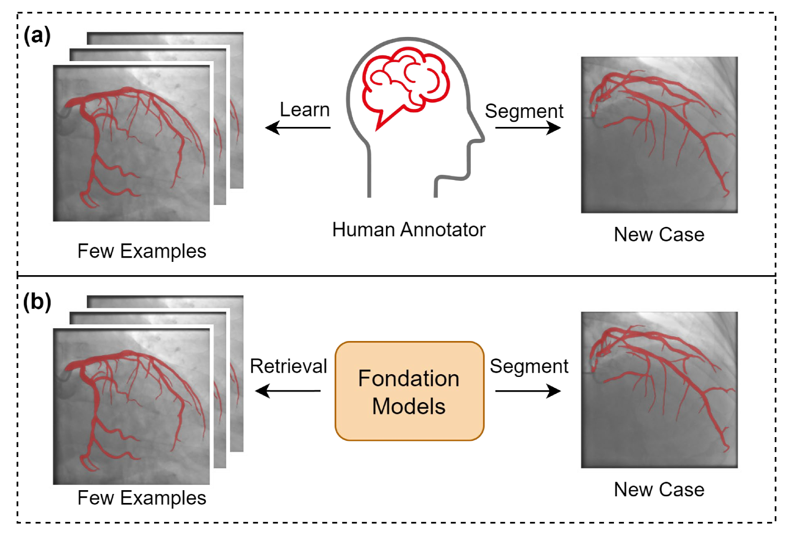
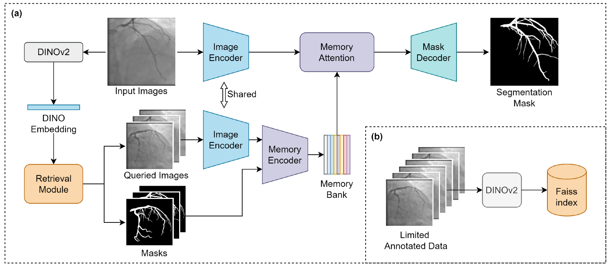
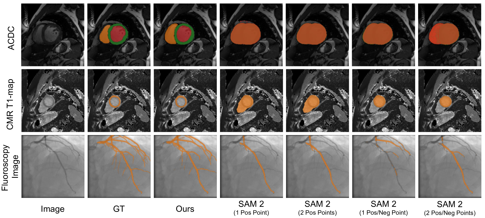
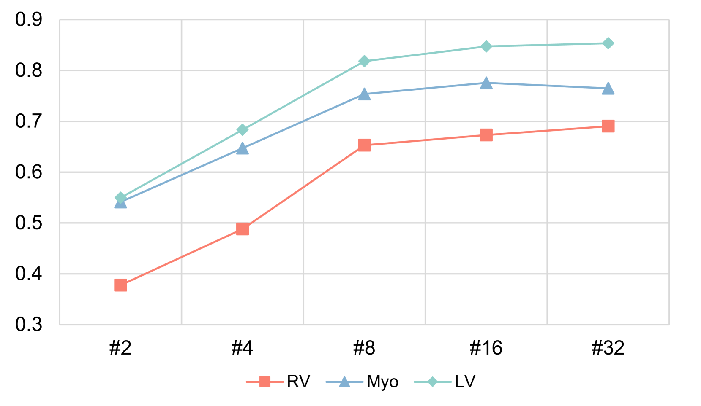
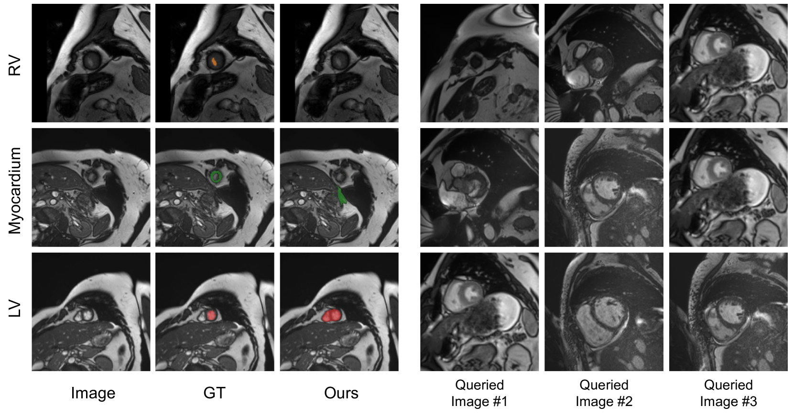

# 利用基础模型进行增强检索的少样本医学图像分割

发布时间：2024年08月16日

`RAG` `图像处理`

> Retrieval-augmented Few-shot Medical Image Segmentation with Foundation Models

# 摘要

> 医学图像分割在临床决策中扮演关键角色，然而，标注数据的稀缺性构成了挑战。尽管少样本分割（FSS）方法有所进展，但它们通常需在特定领域重新训练，且跨模态泛化能力不足。同样，将如Segment Anything Model（SAM）这样的基础模型应用于医学影像也面临微调和领域适应的难题。为此，我们创新性地结合DINOv2与Segment Anything Model 2（SAM 2），提出了一种检索增强的少样本医学图像分割方法。该方法利用DINOv2特征从有限标注数据中检索相似样本，并将其编码为记忆存储于记忆库。SAM 2的记忆注意力机制则利用这些记忆生成精确的目标图像分割。我们在三个医学图像分割任务中验证了该框架，展现了其在多种模态间的卓越性能和泛化能力，且无需重新训练或微调。这一方法不仅为少样本医学图像分割提供了实用有效的解决方案，还具有成为临床应用中宝贵标注工具的潜力。

> Medical image segmentation is crucial for clinical decision-making, but the scarcity of annotated data presents significant challenges. Few-shot segmentation (FSS) methods show promise but often require retraining on the target domain and struggle to generalize across different modalities. Similarly, adapting foundation models like the Segment Anything Model (SAM) for medical imaging has limitations, including the need for finetuning and domain-specific adaptation. To address these issues, we propose a novel method that adapts DINOv2 and Segment Anything Model 2 (SAM 2) for retrieval-augmented few-shot medical image segmentation. Our approach uses DINOv2's feature as query to retrieve similar samples from limited annotated data, which are then encoded as memories and stored in memory bank. With the memory attention mechanism of SAM 2, the model leverages these memories as conditions to generate accurate segmentation of the target image. We evaluated our framework on three medical image segmentation tasks, demonstrating superior performance and generalizability across various modalities without the need for any retraining or finetuning. Overall, this method offers a practical and effective solution for few-shot medical image segmentation and holds significant potential as a valuable annotation tool in clinical applications.

[Arxiv](https://arxiv.org/abs/2408.08813)