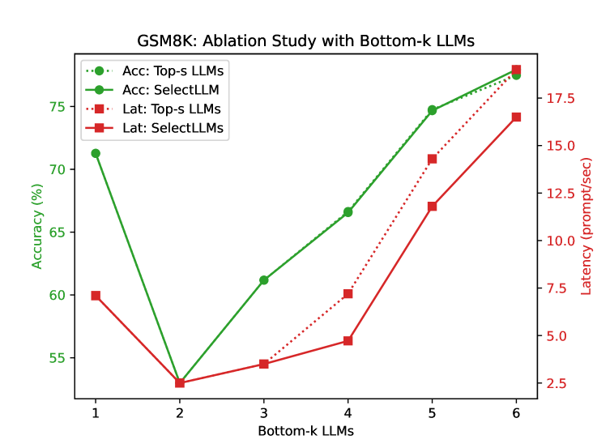

# SelectLLM：一种针对大型语言模型的高效查询感知选择算法

发布时间：2024年08月16日

`LLM应用` `人工智能` `计算机科学`

> SelectLLM: Query-Aware Efficient Selection Algorithm for Large Language Models

# 摘要

> 大型语言模型 (LLM) 因其卓越的跨任务表现而备受瞩目，推动了多样化 LLM 的快速发展。然而，单个 LLM 在处理复杂任务时受限于训练偏差、模型规模及数据集等因素。为此，我们提出了一种创新的 LLM 选择算法——SelectLLM，旨在高效整合 LLM 的多样化能力，以克服个体局限。SelectLLM 通过引导输入查询至最佳 LLM 子集，确保高效且准确地响应。该算法采用多标签分类器，结合预测与置信度评分，精心设计选择策略，以选出最优、适应性强且轻量级的 LLM 子集。实证研究表明，SelectLLM 不仅超越了单个 LLM，更在与高计算成本的同类顶级 LLM 子集对比中，展现了卓越的性能。具体而言，在 GSM8K 和 MMLU 两大推理基准测试中，SelectLLM 分别实现了 13% 和 70% 的延迟降低。此外，通过详尽的分析与消融研究，进一步证实了该模型的稳健性。

> Large language models (LLMs) have gained increased popularity due to their remarkable success across various tasks, which has led to the active development of a large set of diverse LLMs. However, individual LLMs have limitations when applied to complex tasks because of such factors as training biases, model sizes, and the datasets used. A promising approach is to efficiently harness the diverse capabilities of LLMs to overcome these individual limitations. Towards this goal, we introduce a novel LLM selection algorithm called SelectLLM. This algorithm directs input queries to the most suitable subset of LLMs from a large pool, ensuring they collectively provide the correct response efficiently. SelectLLM uses a multi-label classifier, utilizing the classifier's predictions and confidence scores to design optimal policies for selecting an optimal, query-aware, and lightweight subset of LLMs. Our findings show that the proposed model outperforms individual LLMs and achieves competitive performance compared to similarly sized, computationally expensive top-performing LLM subsets. Specifically, with a similarly sized top-performing LLM subset, we achieve a significant reduction in latency on two standard reasoning benchmarks: 13% lower latency for GSM8K and 70% lower latency for MMLU. Additionally, we conduct comprehensive analyses and ablation studies, which validate the robustness of the proposed model.

[Arxiv](https://arxiv.org/abs/2408.08545)