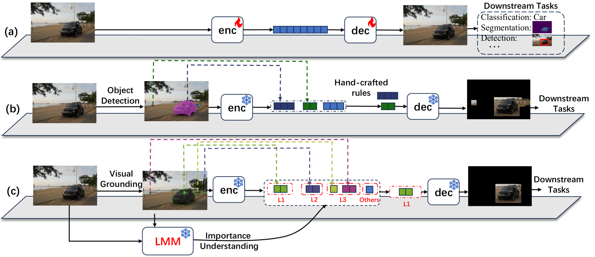
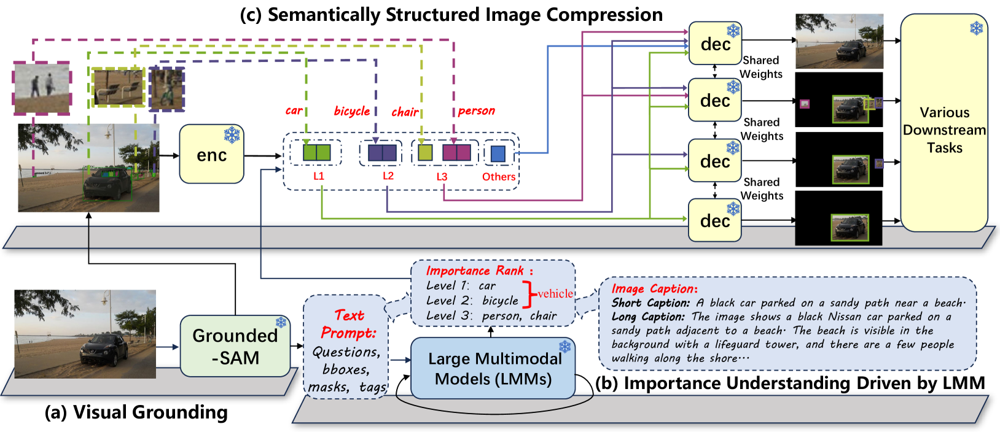
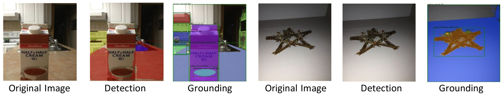
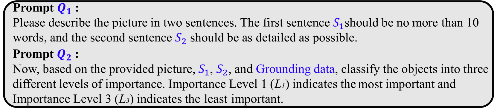
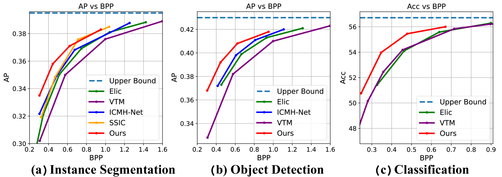
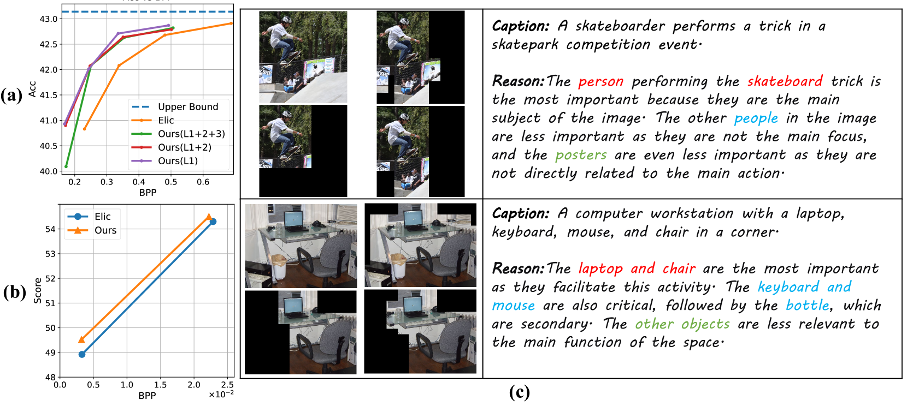

# 指导 Codec 压缩要点：利用 LMMs 实现机器语义解耦的图像编码

发布时间：2024年08月16日

`LLM应用` `计算机视觉` `图像处理`

> Tell Codec What Worth Compressing: Semantically Disentangled Image Coding for Machine with LMMs

# 摘要

> 我们创新性地提出了一种图像压缩方法，名为“SDComp”，即“语义解纠缠压缩”，旨在通过巧妙运用大型多模态模型的常识，实现为机器智能编码。不同于传统图像压缩为人眼优化，SDComp专注于使压缩比特流更贴合下游智能分析任务。我们利用LMM的强大语义理解能力，通过提示进行对象定位、识别和重要性排序，从而在压缩前解开图像内容。基于这些语义先验，我们以结构化比特流按序编码和传输图像对象，确保多样化视觉任务如图像分类、对象检测等得到良好支持。与顶尖编解码器相比，SDComp不仅提供更灵活的重建结果和高质量的视觉解码，还展现出更广泛的智能任务支持能力。

> We present a new image compression paradigm to achieve ``intelligently coding for machine'' by cleverly leveraging the common sense of Large Multimodal Models (LMMs). We are motivated by the evidence that large language/multimodal models are powerful general-purpose semantics predictors for understanding the real world. Different from traditional image compression typically optimized for human eyes, the image coding for machines (ICM) framework we focus on requires the compressed bitstream to more comply with different downstream intelligent analysis tasks. To this end, we employ LMM to \textcolor{red}{tell codec what to compress}: 1) first utilize the powerful semantic understanding capability of LMMs w.r.t object grounding, identification, and importance ranking via prompts, to disentangle image content before compression, 2) and then based on these semantic priors we accordingly encode and transmit objects of the image in order with a structured bitstream. In this way, diverse vision benchmarks including image classification, object detection, instance segmentation, etc., can be well supported with such a semantically structured bitstream. We dub our method ``\textit{SDComp}'' for ``\textit{S}emantically \textit{D}isentangled \textit{Comp}ression'', and compare it with state-of-the-art codecs on a wide variety of different vision tasks. SDComp codec leads to more flexible reconstruction results, promised decoded visual quality, and a more generic/satisfactory intelligent task-supporting ability.

[Arxiv](https://arxiv.org/abs/2408.08575)