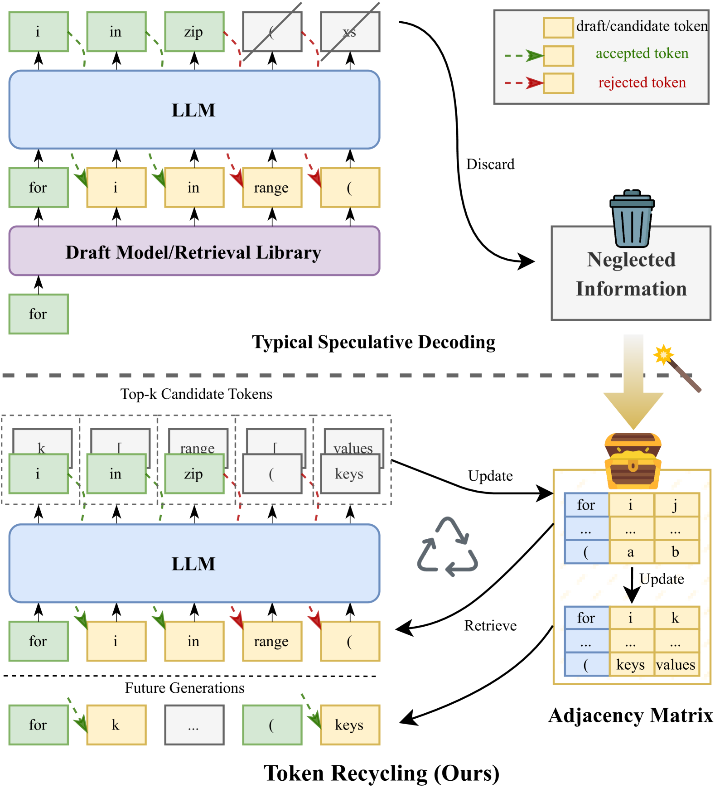
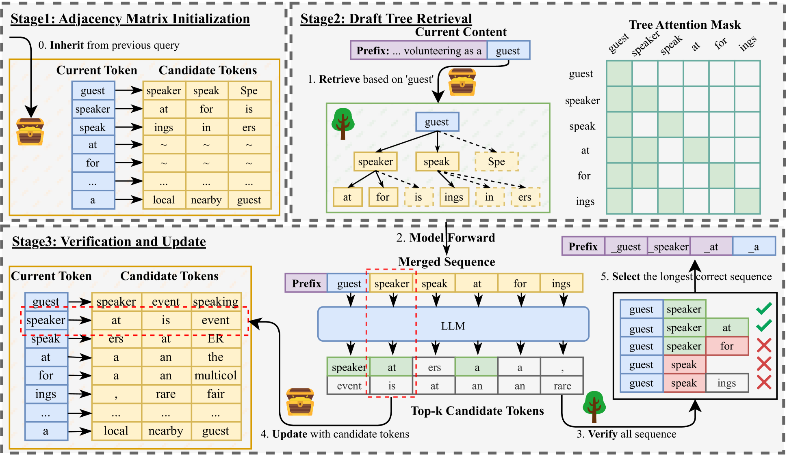
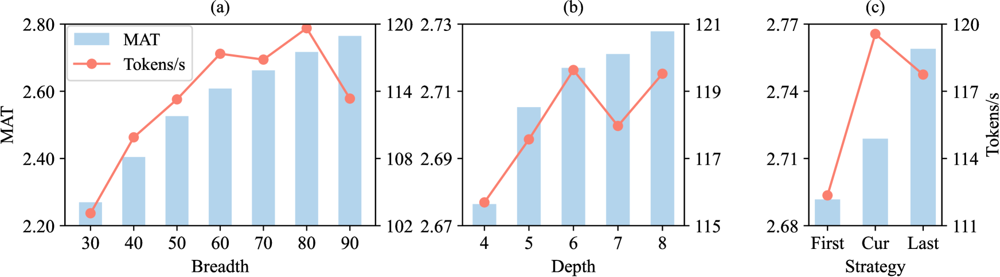
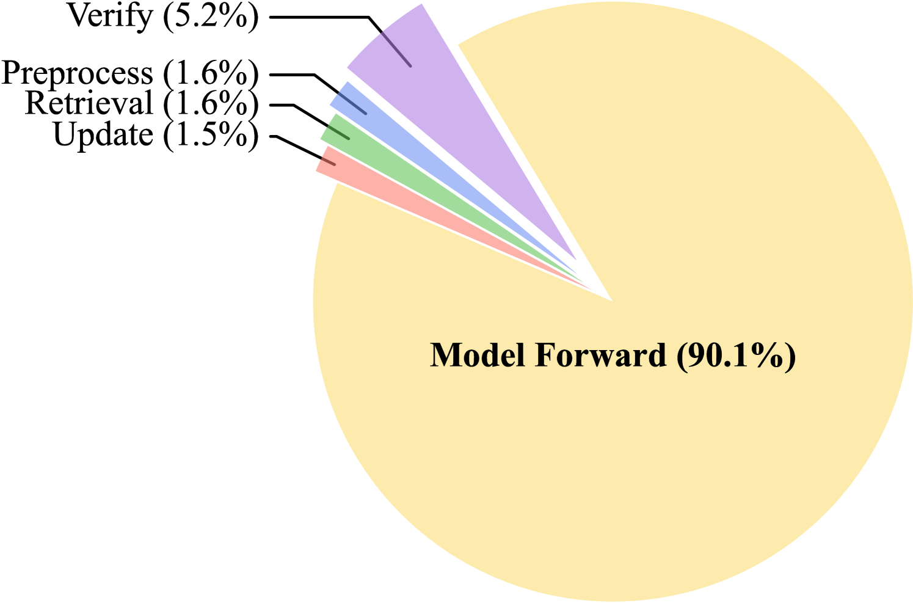
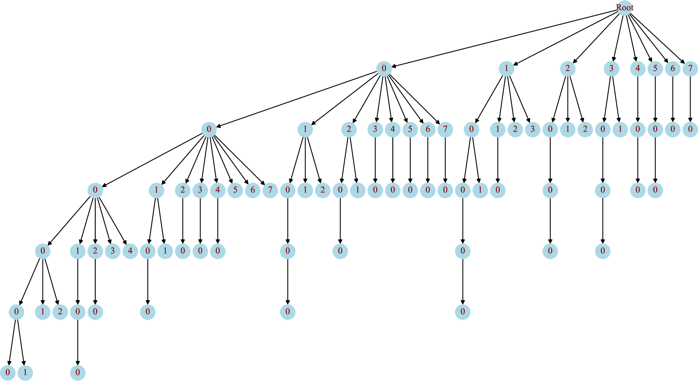

# 化废为宝：利用 Token 回收技术加速大型语言模型的推理过程

发布时间：2024年08月16日

`LLM应用` `人工智能` `计算机科学`

> Turning Trash into Treasure: Accelerating Inference of Large Language Models with Token Recycling

# 摘要

> 随着大型语言模型（LLM）参数的激增，推理延迟已成为其广泛应用的瓶颈。为此，我们引入了推测解码技术，通过猜测与验证的并行处理，无损地加速推理过程。该技术或依赖于小型模型等额外结构进行初步令牌猜测，需预先训练；或采用基于检索的无训练方法，从现有语料库中构建库，但面临存储量大、检索耗时及适应性有限的问题。我们观察到解码过程中生成的候选令牌常在后续序列中重现，因此提出了创新的“令牌回收”方法。该方法将候选令牌存储于邻接矩阵，并运用类似广度优先搜索的算法构建草稿树，再通过树注意力机制进行验证，随后用新令牌更新矩阵。仅需不到2MB的额外存储，便能在各类LLM上实现近两倍的加速，性能远超现有无训练方法30%，甚至优于某些训练方法25%。此技术可无缝应用于任何LLM及任务，无需额外适应。

> The rapid growth in the parameters of large language models (LLMs) has made inference latency a fundamental bottleneck, limiting broader application of LLMs. Speculative decoding represents a lossless approach to accelerate inference through a guess-and-verify paradigm, leveraging the parallel capabilities of modern hardware. Some speculative decoding methods rely on additional structures to guess draft tokens, such as small models or parameter-efficient architectures, which need extra training before use. Alternatively, retrieval-based train-free techniques build libraries from pre-existing corpora or by n-gram generation. However, they face challenges like large storage requirements, time-consuming retrieval, and limited adaptability. Observing that candidate tokens generated during the decoding process are likely to reoccur in future sequences, we propose Token Recycling. This approach stores candidate tokens in an adjacency matrix and employs a breadth-first search (BFS)-like algorithm on the matrix to construct a draft tree. The tree is then validated through tree attention. New candidate tokens from the decoding process are then used to update the matrix. Token Recycling requires \textless2MB of additional storage and achieves approximately 2x speedup across all sizes of LLMs. It significantly outperforms existing train-free methods by 30\% and even a training method by 25\%. It can be directly applied to any existing LLMs and tasks without the need for adaptation.

[Arxiv](https://arxiv.org/abs/2408.08696)