# 视觉代理：快速与慢速思考的双重角色

发布时间：2024年08月16日

`Agent` `人工智能` `视觉识别`

> Visual Agents as Fast and Slow Thinkers

# 摘要

> 要达到人类水平的智能，关键在于细化系统1与系统2思维的认知差异。当前AI虽由大型语言模型驱动，展现出类人特质，但仍未触及真正认知。从结构化测试转向真实场景，视觉代理面临挑战，常给出不准确且过度自信的答案。为此，我们推出FaST，融合快慢思维机制于视觉代理，通过切换适配器动态选择系统1/2模式，依据任务复杂度定制解题策略。FaST通过调整模型信心与整合新情境数据，应对未知与不确定性。此创新设计强调系统灵活性、层次推理及透明决策流程，助力模拟人类视觉认知。实测表明，FaST在视觉问答与推理分割任务中表现卓越，核心组件经广泛验证，展现其在AI领域推动认知视觉代理发展的潜力。

> Achieving human-level intelligence requires refining cognitive distinctions between System 1 and System 2 thinking. While contemporary AI, driven by large language models, demonstrates human-like traits, it falls short of genuine cognition. Transitioning from structured benchmarks to real-world scenarios presents challenges for visual agents, often leading to inaccurate and overly confident responses. To address the challenge, we introduce FaST, which incorporates the Fast and Slow Thinking mechanism into visual agents. FaST employs a switch adapter to dynamically select between System 1/2 modes, tailoring the problem-solving approach to different task complexity. It tackles uncertain and unseen objects by adjusting model confidence and integrating new contextual data. With this novel design, we advocate a flexible system, hierarchical reasoning capabilities, and a transparent decision-making pipeline, all of which contribute to its ability to emulate human-like cognitive processes in visual intelligence. Empirical results demonstrate that FaST outperforms various well-known baselines, achieving 80.8% accuracy over VQA^{v2} for visual question answering and 48.7% GIoU score over ReasonSeg for reasoning segmentation, demonstrate FaST's superior performance. Extensive testing validates the efficacy and robustness of FaST's core components, showcasing its potential to advance the development of cognitive visual agents in AI systems.

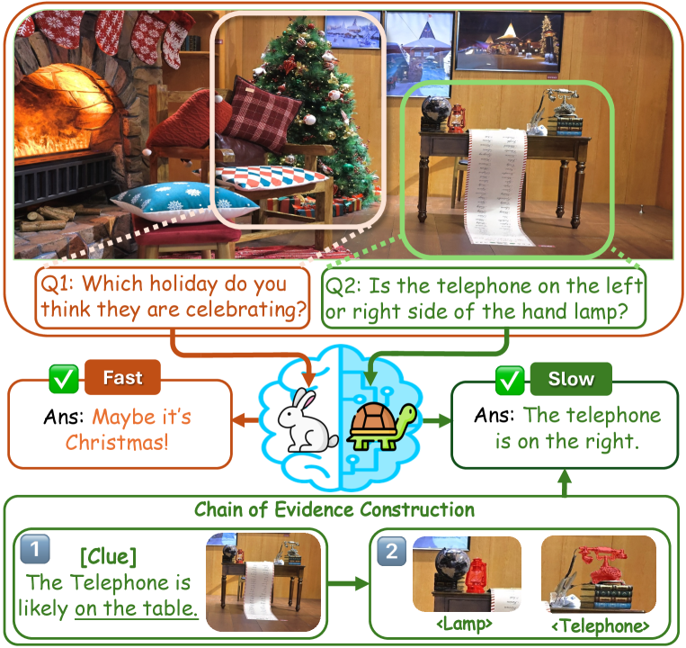

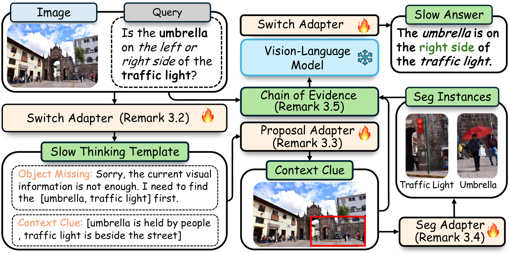

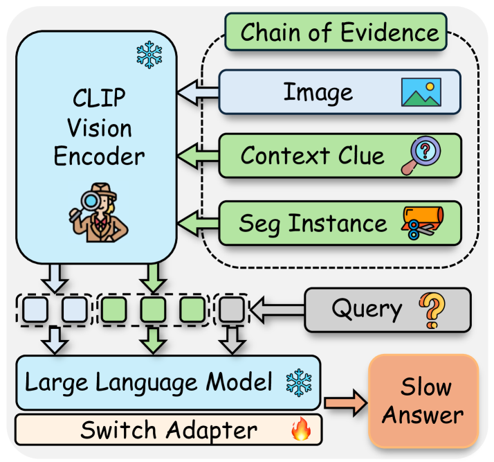

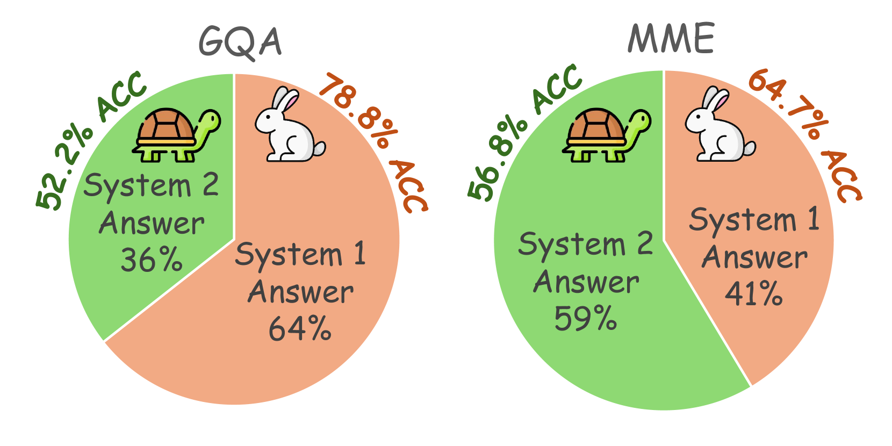

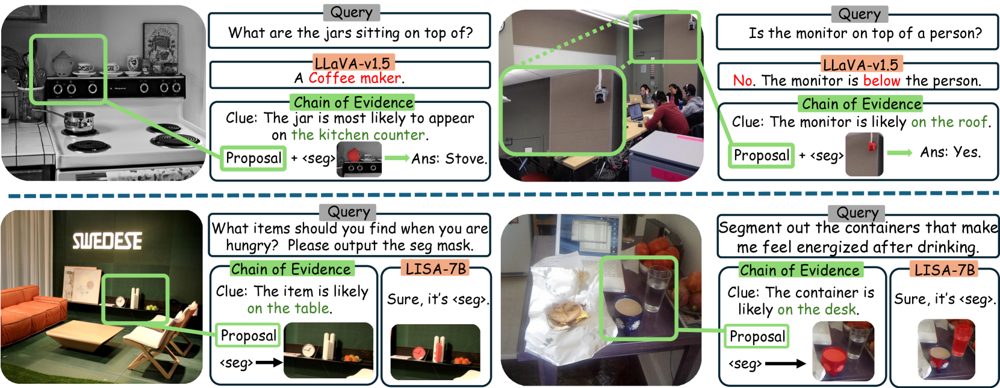

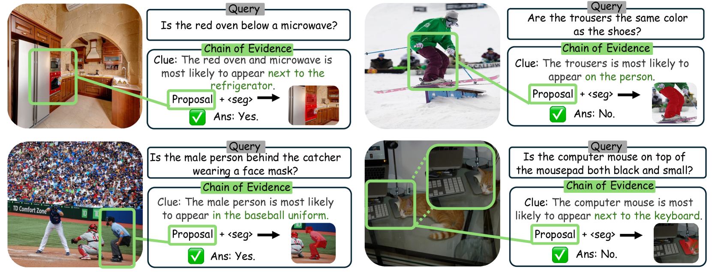

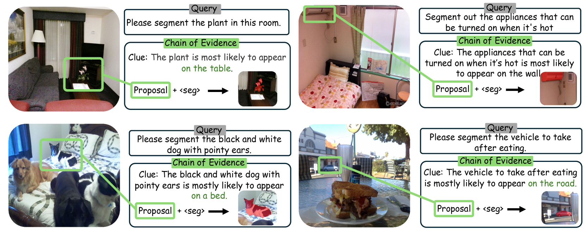

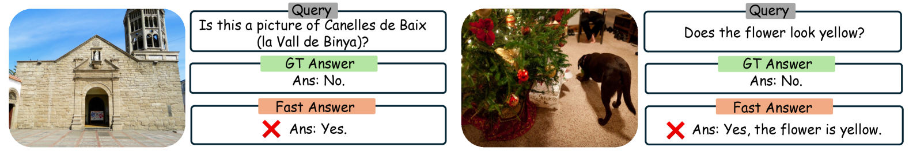

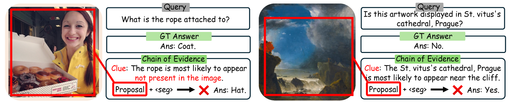

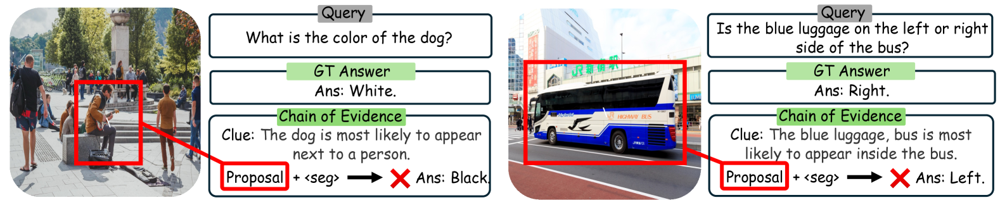

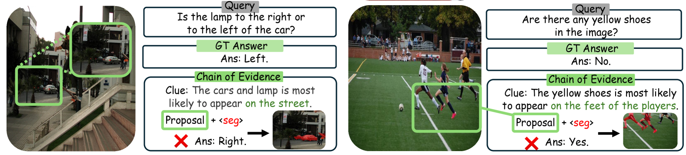

[Arxiv](https://arxiv.org/abs/2408.08862)