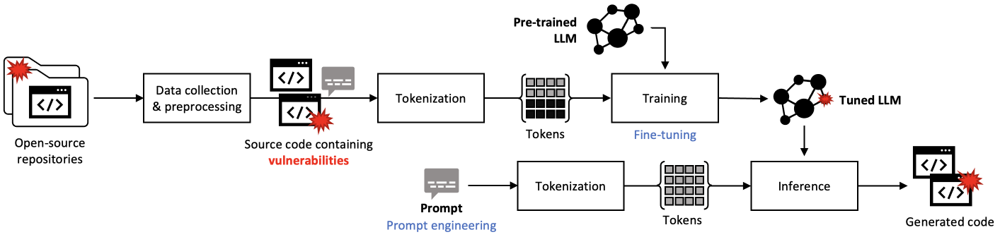
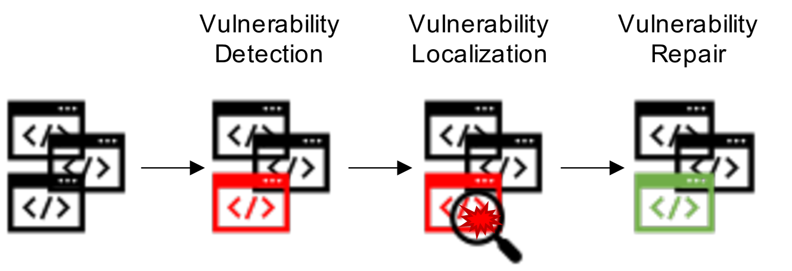

# AI代码漏洞处理：探索现有方案与未解难题

发布时间：2024年08月16日

`LLM应用` `软件工程` `网络安全`

> Vulnerability Handling of AI-Generated Code -- Existing Solutions and Open Challenges

# 摘要

> 随着生成式AI在软件工程中的广泛应用，尤其是LLMs在代码生成方面的突破，专业软件开发迎来了生产力和自动化的新时代。然而，这一变革也带来了一个不容忽视的问题：代码安全漏洞的引入。这些漏洞往往源自训练数据的瑕疵，进而影响生成代码的质量，使得漏洞的识别变得复杂。传统的漏洞处理依赖于人工审查，但将其应用于AI生成的代码则面临更多挑战。AI代码可能包含多种形式的漏洞，因为开发者可能不会直接依赖现有代码，而是通过提示来完成类似任务。本研究聚焦于基于LLM的漏洞处理技术，涵盖检测、定位和修复等关键环节，旨在梳理最新进展并指出未来研究方向，以构建一个既可靠又高效的AI生成代码漏洞处理体系。

> The increasing use of generative Artificial Intelligence (AI) in modern software engineering, particularly Large Language Models (LLMs) for code generation, has transformed professional software development by boosting productivity and automating development processes. This adoption, however, has highlighted a significant issue: the introduction of security vulnerabilities into the code. These vulnerabilities result, e.g., from flaws in the training data that propagate into the generated code, creating challenges in disclosing them. Traditional vulnerability handling processes often involve extensive manual review. Applying such traditional processes to AI-generated code is challenging. AI-generated code may include several vulnerabilities, possibly in slightly different forms as developers might not build on already implemented code but prompt similar tasks. In this work, we explore the current state of LLM-based approaches for vulnerability handling, focusing on approaches for vulnerability detection, localization, and repair. We provide an overview of recent progress in this area and highlight open challenges that must be addressed in order to establish a reliable and scalable vulnerability handling process of AI-generated code.

[Arxiv](https://arxiv.org/abs/2408.08549)