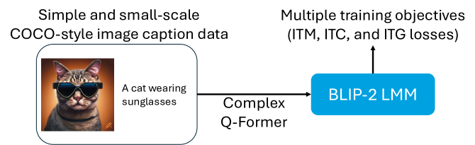
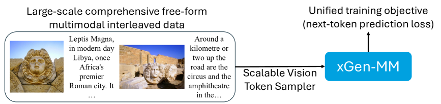
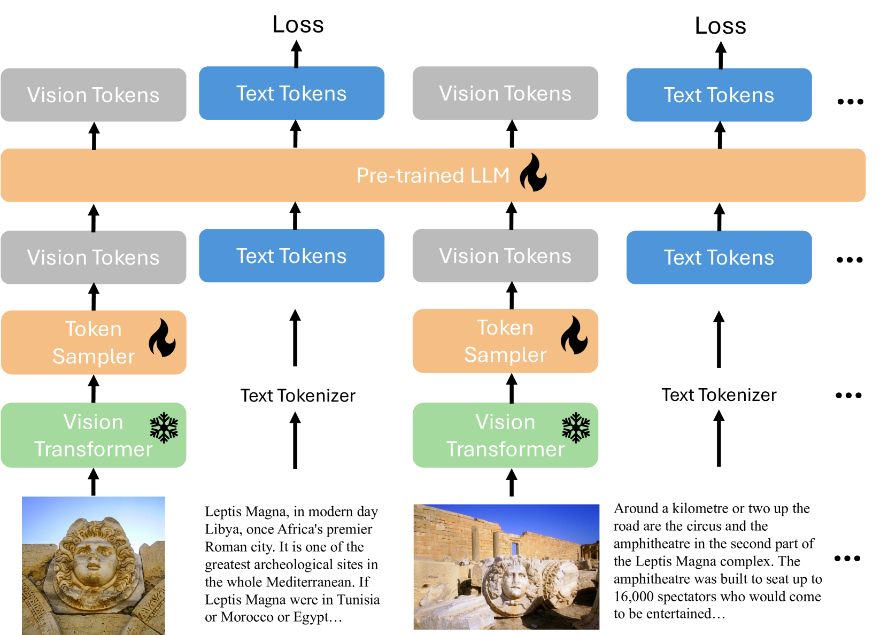
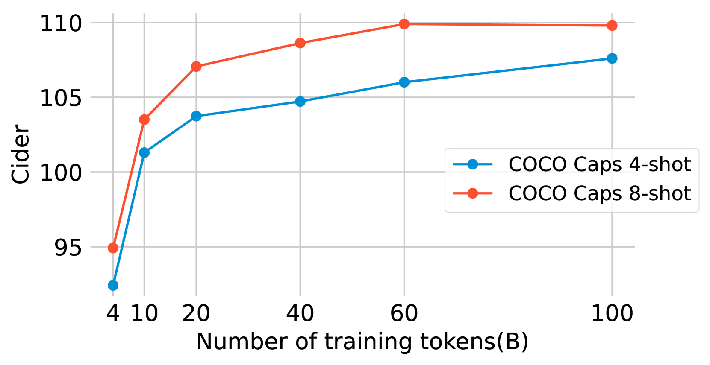
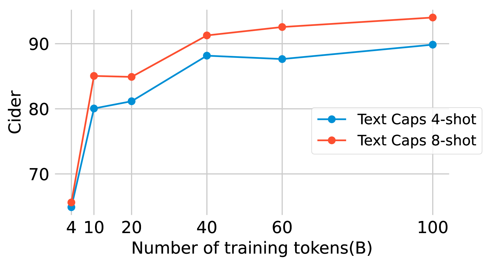
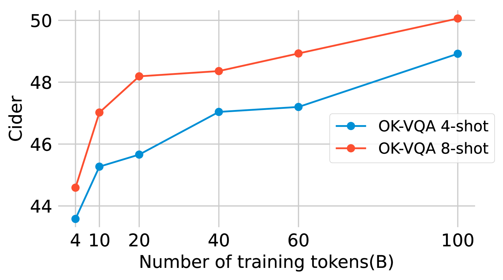
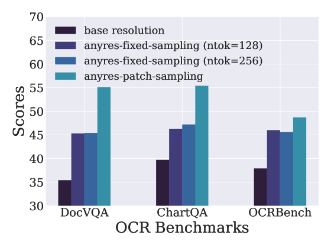
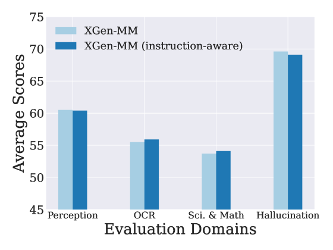

# xGen-MM (BLIP-3)：开放式大型多模态模型系列

发布时间：2024年08月16日

`LLM应用` `人工智能` `多模态学习`

> xGen-MM (BLIP-3): A Family of Open Large Multimodal Models

# 摘要

> 本报告详述了 xGen-MM（BLIP-3）框架，专为大型多模态模型（LMMs）的开发而设计。该框架整合了精选数据集、训练策略、模型架构及一系列 LMMs。xGen-MM，简称 xGen-MultiModal，是 Salesforce xGen 在基础 AI 模型领域的拓展。我们的模型在单图像与多图像基准等多项任务上接受了严格评估。预训练基础模型展现出卓越的上下文学习能力，而经过指令优化的模型在同等规模的开源 LMMs 中表现突出。同时，我们推出了一款经 DPO 安全调校的模型，旨在减少幻觉等不良行为，增强模型安全性。为推动 LMM 研究进展，我们公开了模型、大规模数据集及微调代码库。相关资源将在项目页面上开放获取。

> This report introduces xGen-MM (also known as BLIP-3), a framework for developing Large Multimodal Models (LMMs). The framework comprises meticulously curated datasets, a training recipe, model architectures, and a resulting suite of LMMs. xGen-MM, short for xGen-MultiModal, expands the Salesforce xGen initiative on foundation AI models. Our models undergo rigorous evaluation across a range of tasks, including both single and multi-image benchmarks. Our pre-trained base model exhibits strong in-context learning capabilities and the instruction-tuned model demonstrates competitive performance among open-source LMMs with similar model sizes. In addition, we introduce a safety-tuned model with DPO, aiming to mitigate harmful behaviors such as hallucinations and improve safety. We open-source our models, curated large-scale datasets, and our fine-tuning codebase to facilitate further advancements in LMM research. Associated resources will be available on our project page above.

[Arxiv](https://arxiv.org/abs/2408.08872)