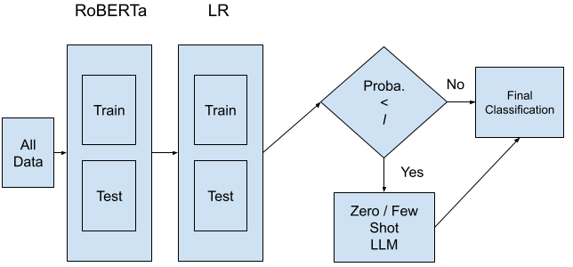
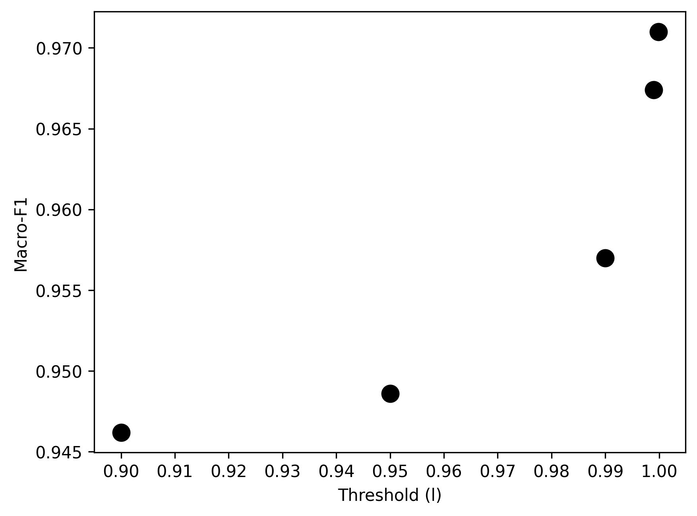
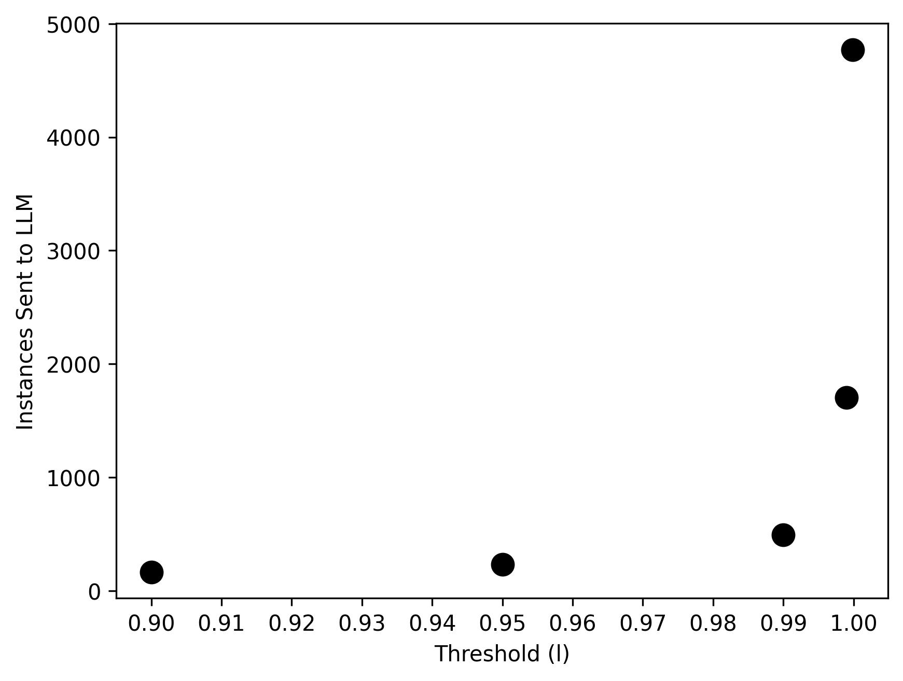
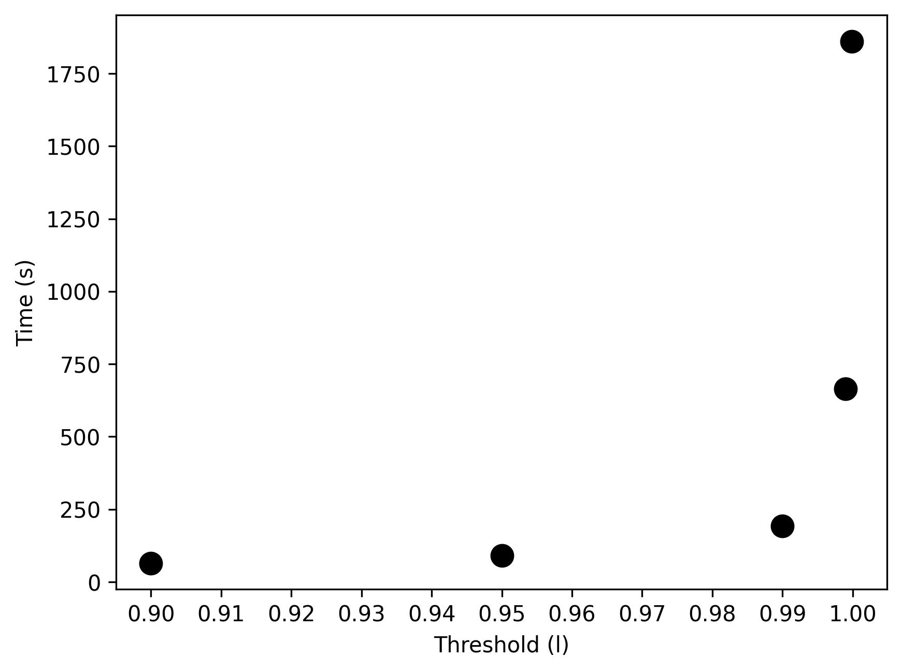

# 结合第一代 Transformers 与开放 LLMs 的自动文本分类策略

发布时间：2024年08月18日

`LLM应用` `情感分析`

> A Strategy to Combine 1stGen Transformers and Open LLMs for Automatic Text Classification

# 摘要

> Transformer 模型在 NLP 领域取得了显著成就，尤其是大型语言模型（LLM），作为第一代 Transformer（1stTR）的进化版，被视为多个 NLP 任务的尖端。然而，现有文献尚未明确证明 LLM 在所有 NLP 任务中始终超越 1stTR。本研究对比了三种 1stTR（BERT、RoBERTa、BART）与两种开放 LLM（Llama 2、Bloom）在 11 个情感分析数据集上的表现。结果显示，开放 LLM 在微调后，在 8 个数据集中可能适度领先或持平 1stTR。但考虑到这种显著的成本仅带来适度的收益，这些模型在成本敏感场景中的实际适用性值得商榷。为此，我们提出了一种基于预测确定性无缝集成 1stTR 和开放 LLM 的信心策略。高信心文档由更具成本效益的 1stTR 处理，而低信心案例则由 LLM 在零-shot 或 few-shot 模式下处理，成本远低于微调版本。情感分析实验证明，我们的方案不仅优于 1stTR、零-shot 和 few-shot LLM，而且以极低成本与微调 LLM 竞争。

> Transformer models have achieved state-of-the-art results, with Large Language Models (LLMs), an evolution of first-generation transformers (1stTR), being considered the cutting edge in several NLP tasks. However, the literature has yet to conclusively demonstrate that LLMs consistently outperform 1stTRs across all NLP tasks. This study compares three 1stTRs (BERT, RoBERTa, and BART) with two open LLMs (Llama 2 and Bloom) across 11 sentiment analysis datasets. The results indicate that open LLMs may moderately outperform or match 1stTRs in 8 out of 11 datasets but only when fine-tuned. Given this substantial cost for only moderate gains, the practical applicability of these models in cost-sensitive scenarios is questionable. In this context, a confidence-based strategy that seamlessly integrates 1stTRs with open LLMs based on prediction certainty is proposed. High-confidence documents are classified by the more cost-effective 1stTRs, while uncertain cases are handled by LLMs in zero-shot or few-shot modes, at a much lower cost than fine-tuned versions. Experiments in sentiment analysis demonstrate that our solution not only outperforms 1stTRs, zero-shot, and few-shot LLMs but also competes closely with fine-tuned LLMs at a fraction of the cost.

[Arxiv](https://arxiv.org/abs/2408.09629)