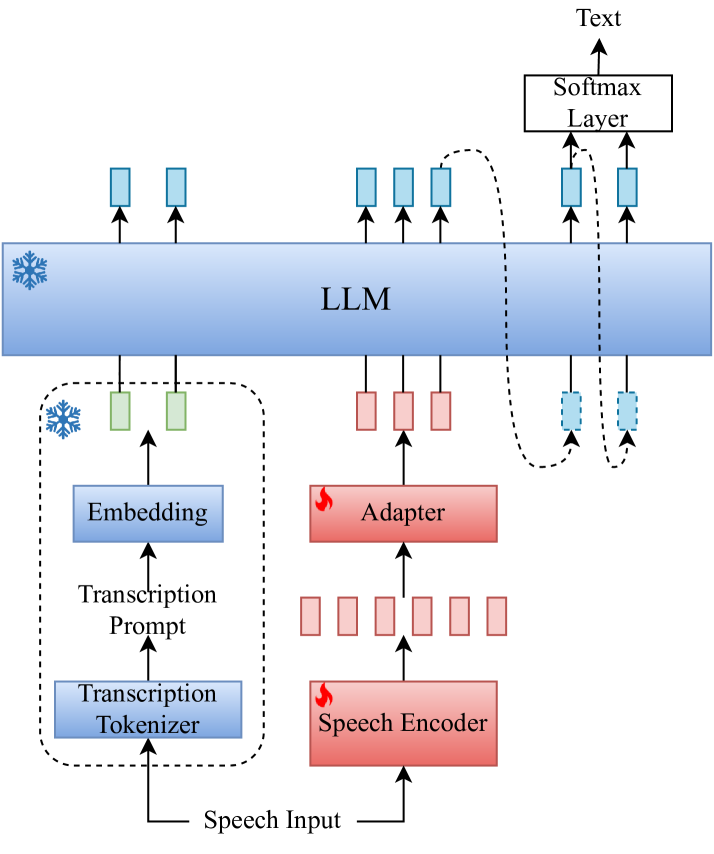
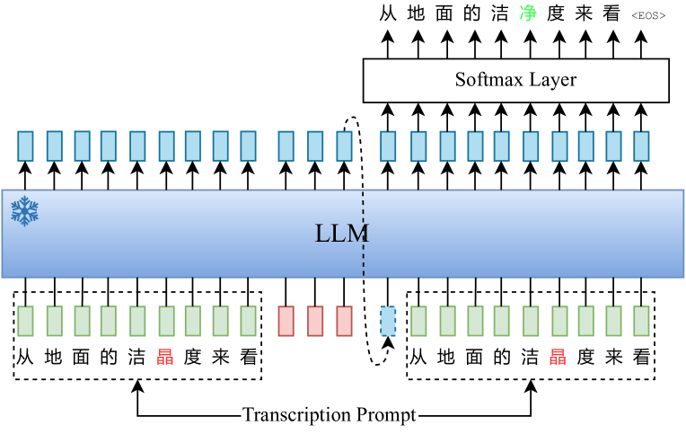

# 我们提出了一种基于转录提示的高效音频大型语言模型，旨在提升语音识别的鲁棒性。

发布时间：2024年08月18日

`LLM应用` `语音识别` `音频处理`

> A Transcription Prompt-based Efficient Audio Large Language Model for Robust Speech Recognition

# 摘要

> Audio-LLM 通过融入音频模态，赋予大型语言模型识别、理解及生成音频的能力。但在嘈杂环境下进行语音识别时，Audio-LLM 出现了幻觉和重复现象，引发替换与插入错误。为此，本文提出一种基于转录提示的改进方案，结合 ASR 专家标记器与混合 AR/NAR 解码策略，有效应对这些问题。实验结果显示，在 10k 小时 WenetSpeech 普通话语料库中，我们的方法在 Test_Net 和 Test_Meeting 评估集上分别降低了 12.2% 和 9.6% 的 CER，并彻底消除了评估集上的解码重复现象。

> Audio-LLM introduces audio modality into a large language model (LLM) to enable a powerful LLM to recognize, understand, and generate audio. However, during speech recognition in noisy environments, we observed the presence of illusions and repetition issues in audio-LLM, leading to substitution and insertion errors. This paper proposes a transcription prompt-based audio-LLM by introducing an ASR expert as a transcription tokenizer and a hybrid Autoregressive (AR) Non-autoregressive (NAR) decoding approach to solve the above problems. Experiments on 10k-hour WenetSpeech Mandarin corpus show that our approach decreases 12.2% and 9.6% CER relatively on Test_Net and Test_Meeting evaluation sets compared with baseline. Notably, we reduce the decoding repetition rate on the evaluation set to zero, showing that the decoding repetition problem has been solved fundamentally.

[Arxiv](https://arxiv.org/abs/2408.09491)