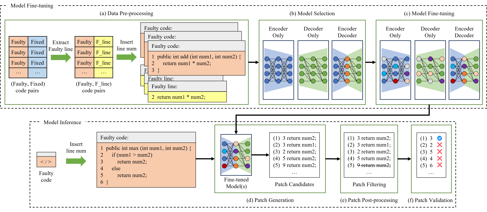

# 大型语言模型在代码故障定位中的影响

发布时间：2024年08月18日

`LLM应用` `软件开发` `自动化测试`

> Impact of Large Language Models of Code on Fault Localization

# 摘要

> 在软件调试中，精准定位错误点至关重要。传统故障定位技术依赖于程序执行和代码覆盖矩阵与测试结果的结合。而基于学习的故障定位技术则通过机器学习模型从代码覆盖矩阵中提取特征，提升定位性能。然而，这些技术需要可编译的源代码、现有测试用例及特定工具。本文首次提出一种简洁高效的序列生成方法，用于微调代码大型语言模型（LLMCs）进行故障定位任务。我们利用LLMCs在预训练中获得的代码理解能力，针对故障定位任务微调了13种模型。这些模型能分析含语法错误的代码，不受编译限制，但在输入长度上有所限制。我们提取Defects4J基准中的错误方法，进行行级分析，实验显示，微调后的LLMCs在错误定位上表现优异，为故障定位和自动化程序修复任务开辟了新的研究方向。

> Identifying the point of error is imperative in software debugging. Traditional fault localization (FL) techniques rely on executing the program and using the code coverage matrix in tandem with test case results to calculate a suspiciousness score for each function or line. Recently, learning-based FL techniques have harnessed machine learning models to extract meaningful features from the code coverage matrix and improve FL performance. These techniques, however, require compilable source code, existing test cases, and specialized tools for generating the code coverage matrix for each programming language of interest.
  In this paper, we propose, for the first time, a simple but effective sequence generation approach for fine-tuning large language models of code (LLMCs) for FL tasks. LLMCs have recently received much attention for various software engineering problems. In line with these, we leverage the innate understanding of code that LLMCs have acquired through pre-training on large code corpora. Specifically, we fine-tune representative encoder, encoder-decoder, and decoder-based 13 LLMCs for FL tasks. Unlike previous approaches, LLMCs can analyze code sequences even with syntactic errors, since they do not rely on compiled input. Still, they have a limitation on the length of the input data. Therefore, for a fair comparison with existing FL techniques, we extract methods with errors from the project-level benchmark, Defects4J, and analyze them at the line level. Experimental results show that LLMCs fine-tuned with our approach successfully pinpoint error positions in 50.6\%, 64.2\%, and 72.3\% of 1,291 methods in Defects4J for Top-1/3/5 prediction, outperforming the best learning-based state-of-the-art technique by up to 1.35, 1.12, and 1.08 times, respectively. Our findings suggest promising research directions for FL and automated program repair tasks using LLMCs.

[Arxiv](https://arxiv.org/abs/2408.09657)