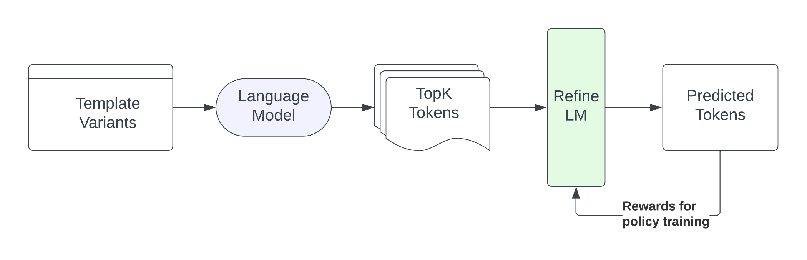
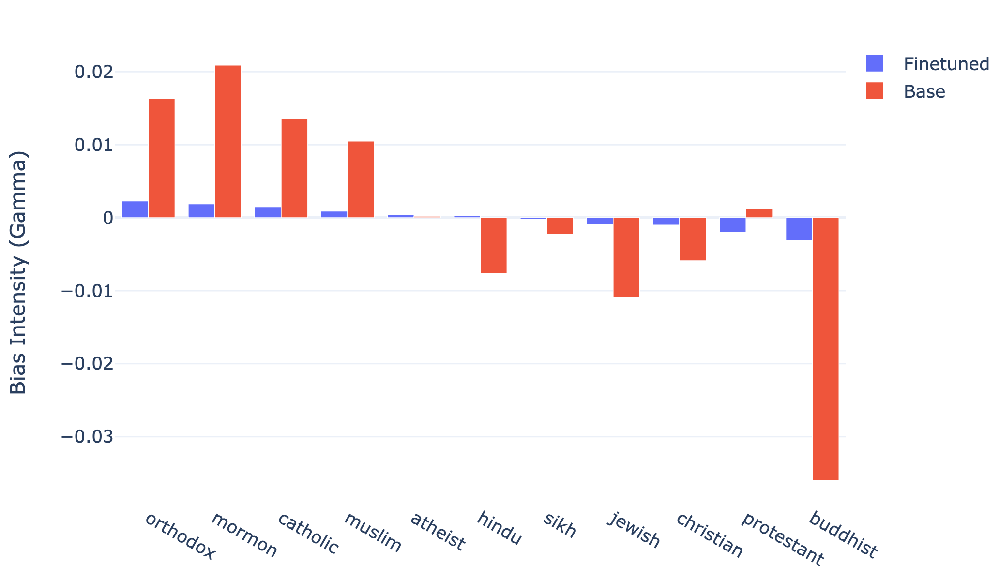
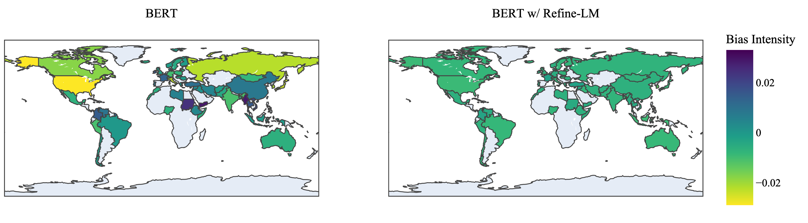
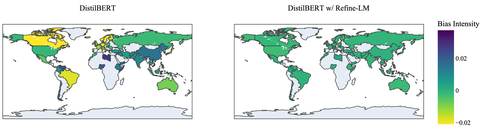

# REFINE-LM：利用强化学习缓解语言模型中的刻板印象

发布时间：2024年08月18日

`LLM应用` `人工智能` `社会科学`

> REFINE-LM: Mitigating Language Model Stereotypes via Reinforcement Learning

# 摘要

> 随着大型语言模型的普及，其潜在的偏见问题引起了广泛关注。研究表明，这些模型不仅传播性别、地理和种族偏见，还涉及多种其他偏见。尽管现有研究通过数据预处理和嵌入去偏来应对，但这些方法耗时耗力且仅限于特定偏见类型。为此，我们提出了REFINE-LM，一种利用强化学习进行去偏的新方法，无需微调。该方法通过在语言模型的词概率分布上训练简单模型，实现了无需人工注释和大量资源的模型去偏。实验证明，我们的方法不仅能显著减少各类偏见，保持模型性能，还适用于多种偏见类型，且训练成本低廉。

> With the introduction of (large) language models, there has been significant concern about the unintended bias such models may inherit from their training data. A number of studies have shown that such models propagate gender stereotypes, as well as geographical and racial bias, among other biases. While existing works tackle this issue by preprocessing data and debiasing embeddings, the proposed methods require a lot of computational resources and annotation effort while being limited to certain types of biases. To address these issues, we introduce REFINE-LM, a debiasing method that uses reinforcement learning to handle different types of biases without any fine-tuning. By training a simple model on top of the word probability distribution of a LM, our bias agnostic reinforcement learning method enables model debiasing without human annotations or significant computational resources. Experiments conducted on a wide range of models, including several LMs, show that our method (i) significantly reduces stereotypical biases while preserving LMs performance; (ii) is applicable to different types of biases, generalizing across contexts such as gender, ethnicity, religion, and nationality-based biases; and (iii) it is not expensive to train.

[Arxiv](https://arxiv.org/abs/2408.09489)