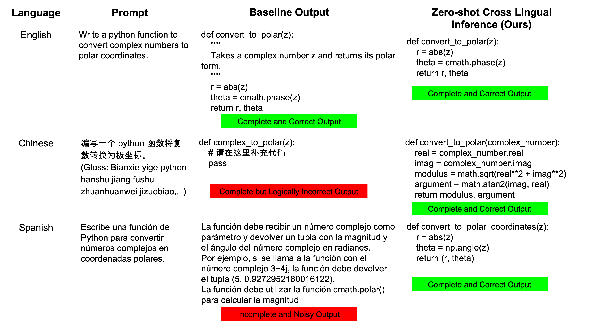
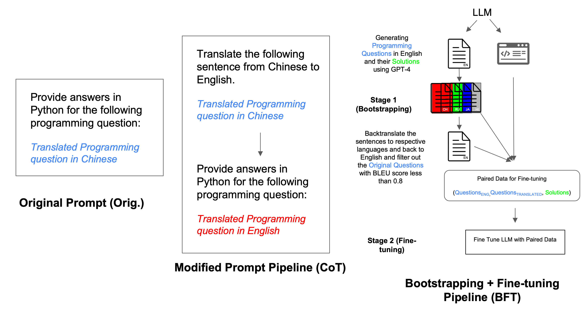
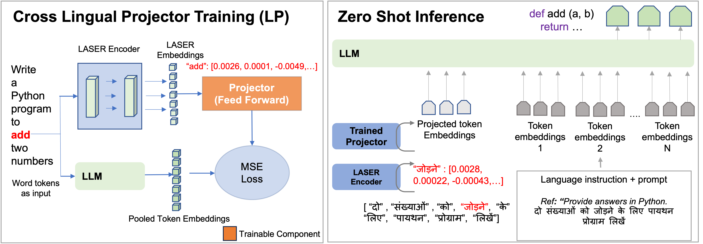
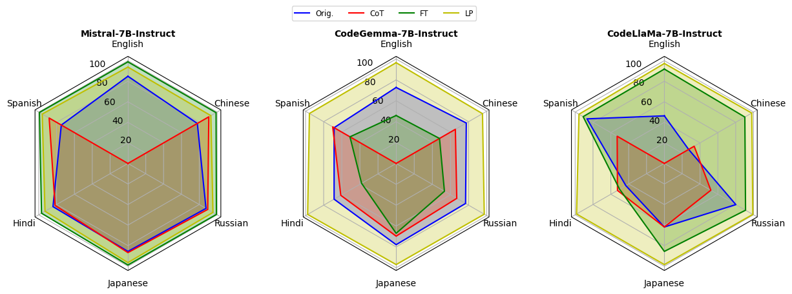

# 借助零-shot跨语言转移技术，我们正努力弥合语言间的鸿沟，以提升LLMs在多语言环境下基于提示的代码生成能力。

发布时间：2024年08月19日

`LLM应用` `多语言处理`

> Bridging the Language Gap: Enhancing Multilingual Prompt-Based Code Generation in LLMs via Zero-Shot Cross-Lingual Transfer

# 摘要

> 大型语言模型（LLM）在程序代码生成领域备受瞩目，但其对非英语提示的偏见和局限性却对全球包容性构成挑战。本文深入探讨了多语言环境下基于提示的代码生成难题。通过评估 CodeLLaMa 和 CodeGemma 等 LLM，我们发现非英语提示下的代码质量存在显著差异，并指出传统方法如提示翻译、数据增强和微调的不足。为此，我们创新性地提出了一种零-shot跨语言策略，采用神经投影技术，并结合 LASER 等跨语言编码器，将多语言嵌入精准映射至 LLM 的标记空间。该方法仅需英语训练数据，便能高效适应其他语言。实验结果表明，在经过严格翻译和质量把控的 MBPP 数据集上，代码质量大幅提升。这项研究不仅强化了 LLM 的多语言处理能力，更在编程领域推动了语言多样性的包容性发展。

> The use of Large Language Models (LLMs) for program code generation has gained substantial attention, but their biases and limitations with non-English prompts challenge global inclusivity. This paper investigates the complexities of multilingual prompt-based code generation. Our evaluations of LLMs, including CodeLLaMa and CodeGemma, reveal significant disparities in code quality for non-English prompts; we also demonstrate the inadequacy of simple approaches like prompt translation, bootstrapped data augmentation, and fine-tuning. To address this, we propose a zero-shot cross-lingual approach using a neural projection technique, integrating a cross-lingual encoder like LASER artetxe2019massively to map multilingual embeddings from it into the LLM's token space. This method requires training only on English data and scales effectively to other languages. Results on a translated and quality-checked MBPP dataset show substantial improvements in code quality. This research promotes a more inclusive code generation landscape by empowering LLMs with multilingual capabilities to support the diverse linguistic spectrum in programming.

[Arxiv](https://arxiv.org/abs/2408.09701)