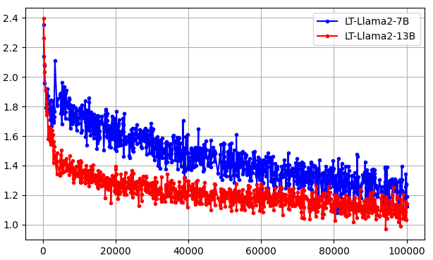
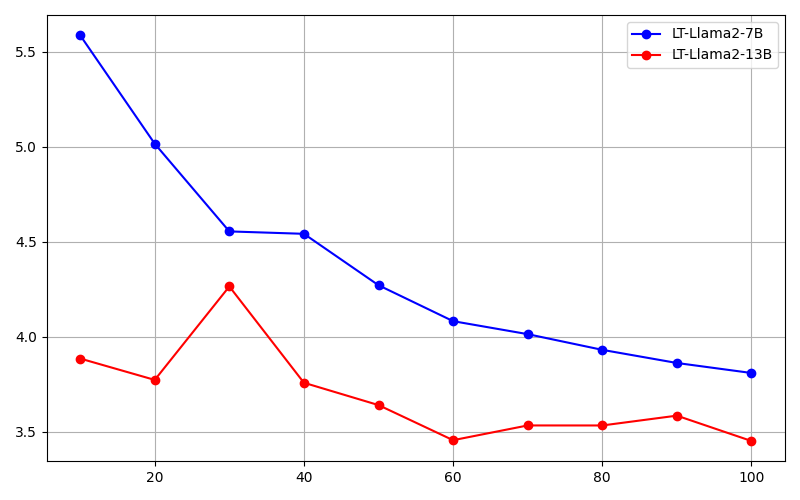
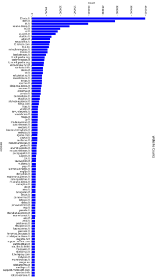
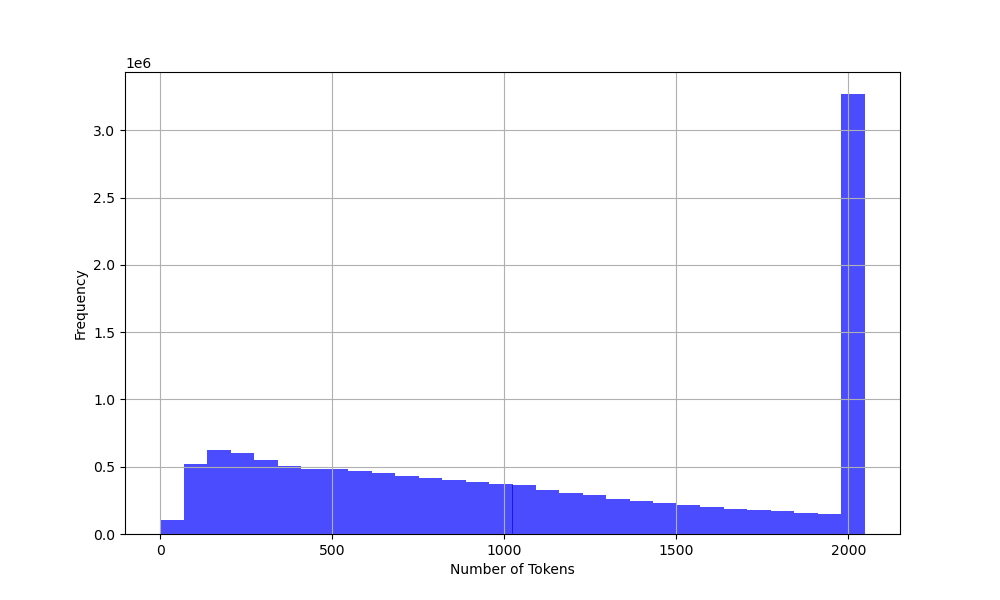

# 立陶宛语的开放 Llama2 模型

发布时间：2024年08月23日

`LLM应用` `人工智能`

> Open Llama2 Model for the Lithuanian Language

# 摘要

> 本文首次介绍了立陶宛语的开源 Llama2 LLM，附带问答数据集及流行基准翻译。简述了区域开放 LLM 并详述了新模型的训练细节。实证评估显示，新模型在困惑度上与现代开放 LLM 相当。语言理解任务基准测试表明，高质量预训练数据集对模型高效性能至关重要。完整模型实现已开放于仓库~\url{https://huggingface.co/neurotechnology}。

> In this paper, we propose and describe the first open Llama2 large language models (LLMs) for the Lithuanian language, including an accompanying question/answer (Q/A) dataset and translations of popular LLM benchmarks. We provide a brief review of open regional LLMs and detailed information on the proposed LLMs and their training process. We also conduct an empirical evaluation, comparing the perplexities of the proposed LLMs with those of other modern open LLMs. In addition, benchmarking the proposed LLMs against language understanding tasks reveals that high-quality pretraining datasets may be essential for achieving models that perform efficiently on these benchmarks. The full realisations of the described LLMs are available in the accompanying open repository~\url{https://huggingface.co/neurotechnology}.

[Arxiv](https://arxiv.org/abs/2408.12963)