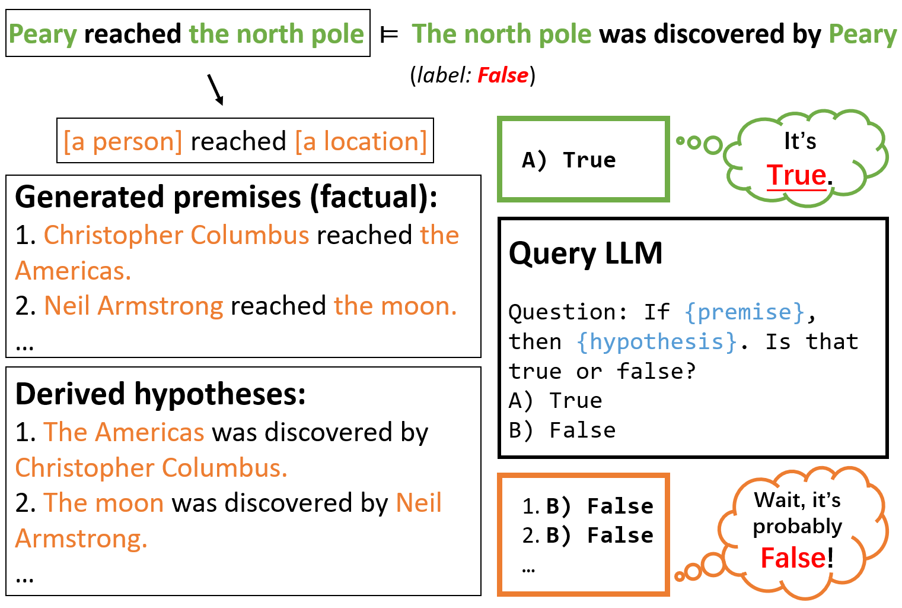

# 利用大型语言模型进行显式归纳推理

发布时间：2024年08月26日

`LLM理论` `人工智能`

> Explicit Inductive Inference using Large Language Models

# 摘要

> 大型语言模型 (LLM) 在推理任务中存在证明偏差问题，即在判断前提 P 是否蕴含假设 H 时，LLM 往往依赖 H 的上下文外真实标签而非其条件真实性。本文提出一种新流程，利用这种偏差进行显式归纳推理。该流程通过 LLM 将前提转换为验证过的替代方案，并汇总新查询答案以支持原始预测。实验表明，此流程能提升 LLM 的推理性能，并有效缓解证明偏差问题。

> Large Language Models (LLMs) are reported to hold undesirable attestation bias on inference tasks: when asked to predict if a premise P entails a hypothesis H, instead of considering H's conditional truthfulness entailed by P, LLMs tend to use the out-of-context truth label of H as a fragile proxy. In this paper, we propose a pipeline that exploits this bias to do explicit inductive inference. Our pipeline uses an LLM to transform a premise into a set of attested alternatives, and then aggregate answers of the derived new entailment inquiries to support the original inference prediction. On a directional predicate entailment benchmark, we demonstrate that by applying this simple pipeline, we can improve the overall performance of LLMs on inference and substantially alleviate the impact of their attestation bias.

[Arxiv](https://arxiv.org/abs/2408.14467)