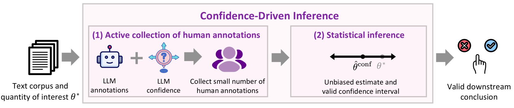
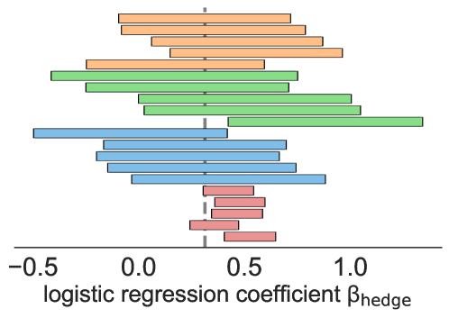
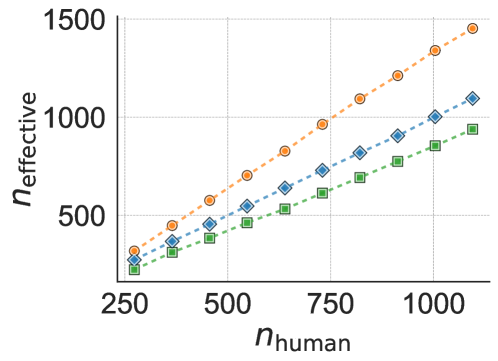

# LLM 的不确定注释，能否转化为确凿结论？

发布时间：2024年08月27日

`LLM应用` `社会科学`

> Can Unconfident LLM Annotations Be Used for Confident Conclusions?

# 摘要

> 大型语言模型 (LLM) 在多项任务中与人类评分高度一致，显示出缓解数据收集难题的潜力。在计算社会科学 (CSS) 领域，LLM 注释正逐渐成为补充人类注释的有效手段，尽管相关操作指南尚不完善。为此，我们提出了信心驱动推理方法，该方法融合 LLM 注释与信心指标，旨在精准选择需收集的人类注释，以产出精确统计估计及有效置信区间，同时大幅减少人类注释需求。此方法内置防护机制，确保结论既有效又与仅依赖人类注释时同样准确。实践证明，在文本礼貌、立场和偏见等 CSS 任务中，信心驱动推理能将人类注释需求降低超 25%。该方法虽以 CSS 为例，实则适用于广泛 NLP 问题的标准量估计。

> Large language models (LLMs) have shown high agreement with human raters across a variety of tasks, demonstrating potential to ease the challenges of human data collection. In computational social science (CSS), researchers are increasingly leveraging LLM annotations to complement slow and expensive human annotations. Still, guidelines for collecting and using LLM annotations, without compromising the validity of downstream conclusions, remain limited. We introduce Confidence-Driven Inference: a method that combines LLM annotations and LLM confidence indicators to strategically select which human annotations should be collected, with the goal of producing accurate statistical estimates and provably valid confidence intervals while reducing the number of human annotations needed. Our approach comes with safeguards against LLM annotations of poor quality, guaranteeing that the conclusions will be both valid and no less accurate than if we only relied on human annotations. We demonstrate the effectiveness of Confidence-Driven Inference over baselines in statistical estimation tasks across three CSS settings--text politeness, stance, and bias--reducing the needed number of human annotations by over 25% in each. Although we use CSS settings for demonstration, Confidence-Driven Inference can be used to estimate most standard quantities across a broad range of NLP problems.

[Arxiv](https://arxiv.org/abs/2408.15204)